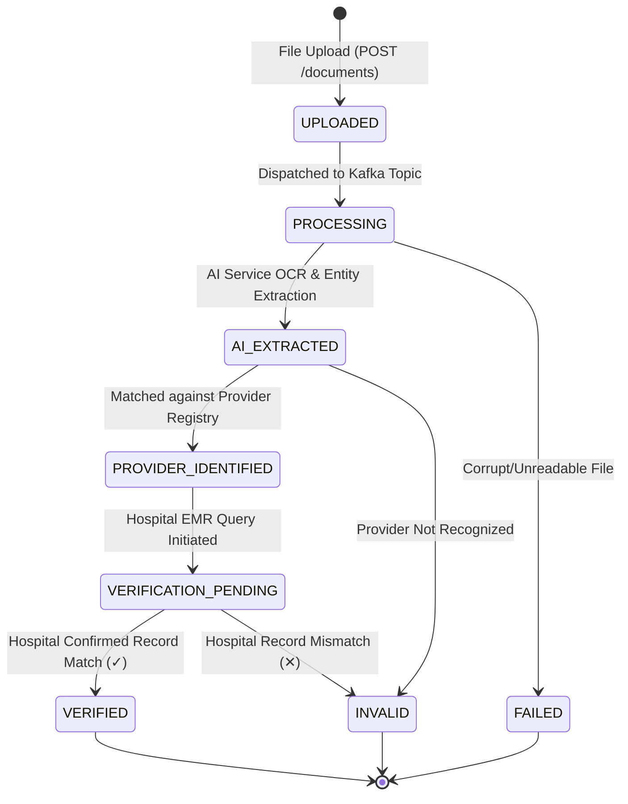

# CareFlow Document Status Model & Lifecycle Contract

> **CRITICAL RULE FOR ALL 3 TEAM MEMBERS:**  
> All services (Frontend, Java Microservices, Python AI workers) MUST strictly use this exact uppercase status vocabulary.  
> Do **NOT** invent variations such as `PROCESSING_DOCUMENT` or `EXTRACTED`.

---

## 1. Status Vocabulary Definition

| Status | Category | Description | Responsible Member |
| :--- | :--- | :--- | :--- |
| **`UPLOADED`** | Initial | PDF file successfully received by API Gateway and stored in object storage. | Member 2 (Gateway) & Member 3 (Frontend) |
| **`PROCESSING`** | Intermediate | Asynchronous ingestion pipeline triggered; payload dispatched to Kafka. | Member 2 (Spring Boot) |
| **`AI_EXTRACTED`** | Intermediate | AI service finished OCR and extracted patient info, diagnosis codes, and provider metadata. | Member 1 (Python AI Service) |
| **`PROVIDER_IDENTIFIED`**| Intermediate | Extracted hospital/doctor matched in National Provider Identifier (NPI) / registry. | Member 2 (Provider Service) |
| **`VERIFICATION_PENDING`**| Intermediate | Direct cryptographic/API cross-check in-flight with hospital EMR database. | Member 2 (Verification Service) |
| **`VERIFIED`** | **Terminal (Success)** | Authenticity, provider registry, and hospital records verified. Process Complete. | Member 2 (Verification Service) |
| **`INVALID`** | **Terminal (Rejection)**| Document details could not be matched with hospital records or failed authenticity check. | Member 2 (Verification Service) |
| **`FAILED`** | **Terminal (Error)** | Unrecoverable technical failure (e.g., corrupt PDF, OCR parsing failure). | Member 1 or Member 2 |

---

## 2. Document Lifecycle State Diagram



---

## 3. Terminal vs Polling States

### Intermediate States (Frontend Continues Polling every 3s)
- `UPLOADED`
- `PROCESSING`
- `AI_EXTRACTED`
- `PROVIDER_IDENTIFIED`
- `VERIFICATION_PENDING`

### Terminal States (Frontend Stops Polling Immediately)
- `VERIFIED` (Success banner)
- `INVALID` (Rejection banner with `rejectionReason`)
- `FAILED` (Error banner with retry prompt)

---

## 4. Rejection & Failure Contract

When `status` is `INVALID`, the response object **MUST** provide a descriptive `rejectionReason`:

```json
{
  "documentId": "DOC10001",
  "fileName": "medical-report.pdf",
  "documentType": "Medical Report",
  "uploadedAt": "2026-08-17T15:30:00Z",
  "status": "INVALID",
  "rejectionReason": "Information provided in the document could not be verified with the provider."
}
```
